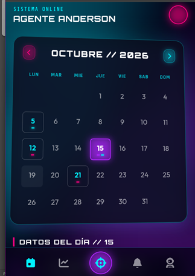
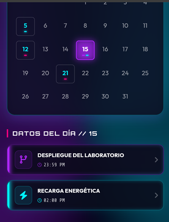

# 🚀 Gosu Calendar UI - Laboratorio Flutter


¡Bienvenido al **Calendario**! Este es un proyecto de laboratorio desarrollado en Flutter enfocado en el diseño de interfaces (UI/UX). La aplicación presenta una interfaz ultra-premium, estilo Cyberpunk y Glassmorphism, con animaciones fluidas y soporte responsivo, construida enteramente utilizando `Row` y `Column`.

---

## 📸 Pantallazos de la Aplicación

<div align="center">
  <!-- MUESTRA TUS PANTALLAZOS AQUÍ -->
  
  <br/>
  <i>Vista del Calendario con efecto de Tilt 3D y Neon.</i>
  <br/><br/>
  
  
  <br/>
  <i>Estructura Responsiva en dispositivos móviles.</i>
</div>

---

## ✨ Características Principales (Features)

- **Cyberpunk & Glassmorphism UI**: Diseño extremo de alta calidad con colores neón, transparencias y desenfoques (blur).
- **Interactividad 3D**: Las tarjetas responden al movimiento del cursor (Hover) inclinándose tridimensionalmente en la web.
- **Animaciones Avanzadas**:
  - Efecto radar rotatorio infinito en el fondo.
  - Entradas escalonadas (`Staggered Animations`) al abrir la app.
  - Transiciones dinámicas al cambiar de fecha.
- **Diseño Funcional de Calendario**: Lógica real para la generación de la cuadrícula de meses y días interactivos.
- **Totalmente Responsivo**: Diseñado y adaptado para verse perfecto tanto en pantallas pequeñas como grandes.
- **Iconos y Fuentes Personalizadas**: Uso de `google_fonts` (Orbitron, Outfit, Rajdhani) y `font_awesome_flutter` para iconos nivel gamer/pro.

---

## 🛠️ Requisitos Cumplidos del Laboratorio

1.  ✅ Mostrar el mes y el año.
2.  ✅ Mostrar los días de la semana y la cuadrícula dinámica.
3.  ✅ Incluir múltiples eventos visuales y el día actual resaltado interactivo.
4.  ✅ **100% construido estructurando con `Row` y `Column`**.
5.  ✅ Personalización masiva de colores, bordes, sombras luminosas y espaciados.

---

## 🚀 Cómo ejecutar el proyecto

Clona el repositorio e instala las dependencias:

```bash
# Instalar dependencias necesarias (Google Fonts, FontAwesome)
flutter pub get

# Ejecutar el proyecto en Google Chrome (Web)
flutter run -d chrome
```

---
